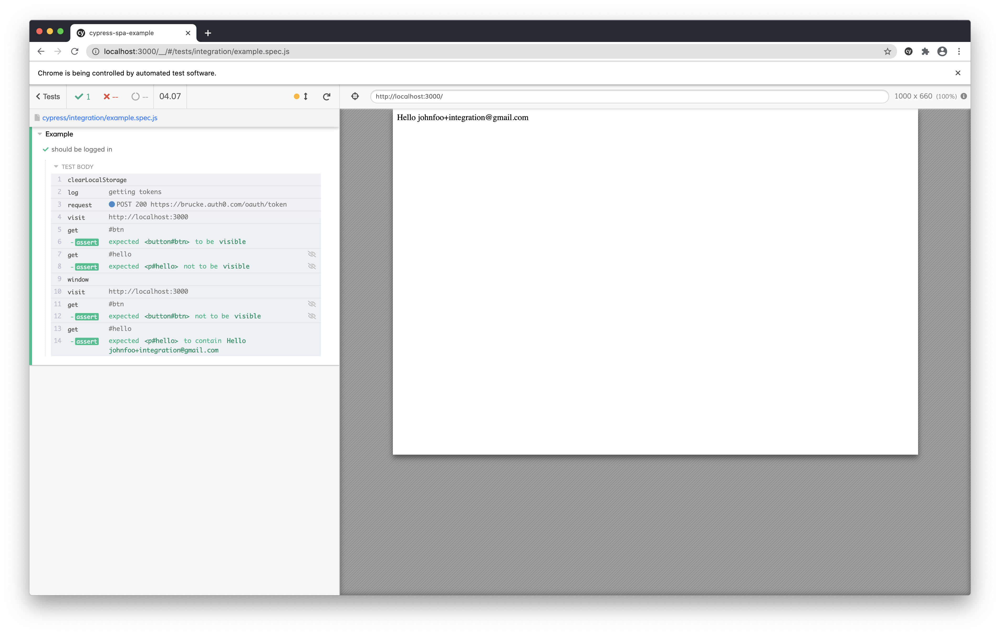

# auth0 / cypress example

- update `client_id`, `domain` etc in [index.html](./index.html) and [example.spec.js](cypress/integration/example.spec.js)
```
$ npx http-server 3000
```
```
$ cypress run
```


